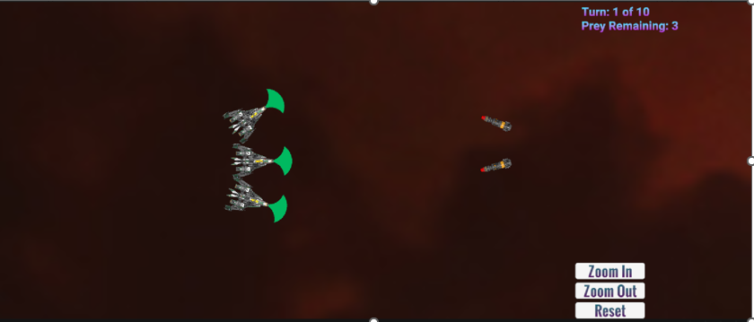

#	Missile Pursuit and Interception Simulation

Missile Pursuit and Interception Simulation in Unity WebGL to model missile guidance dynamics and aircraft evasion strategies for educational exploration.

Try out the simulation here [Missle Pursuit Simulation](https://sfa-cs.github.io/PredatorPreyProject/Prey-Predator-Honors-Project/Output/index.html).

